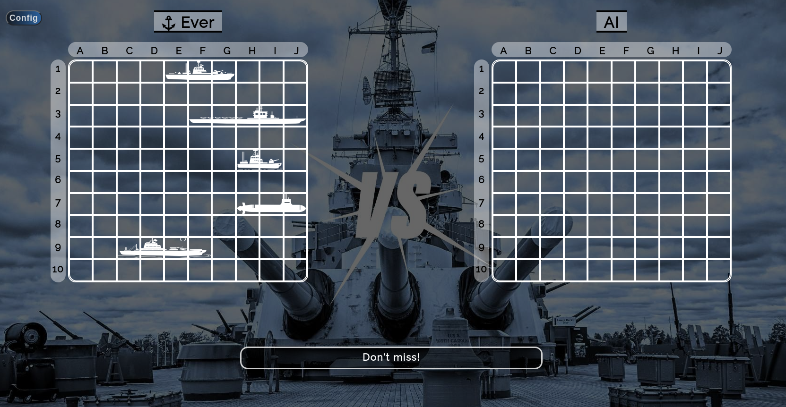
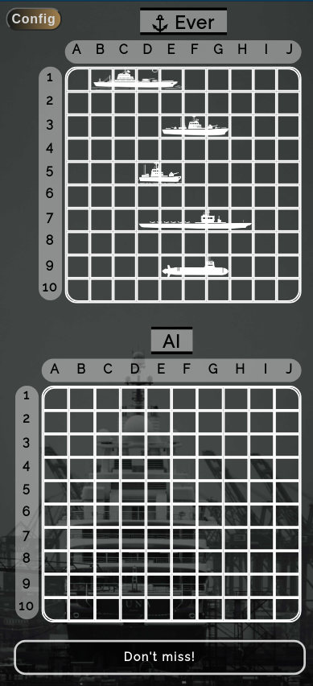

<div align='center'>

# Battleship Game
</div>
<div align='center'>
    <h3>💻 Technologies</h3>
    
    
    
    
    
    
    
    


    <h4><a href="https://asdacosta.github.io/battleship/">Live Preview</a></h4>
</div>

**Demo:**


<details>

**<summary>Screen views</summary>**

**Desktop View:**


<br>

**Mobile View:**




</details>

## 🌐 Origin
[The Odin Project](https://www.theodinproject.com/)

## 📝 Description
Builds interactive Battleship game.

<details>
<summary>Features</summary>

* Player and AI take turns attacking each others grounds.
* Interactive UX
* Real-time feedback section.
* Bulb icon to display Info to understand game.
* Spatial(3d) ⛴️ or Simple 🎨 dimension.
* Random placement and Alignment option.
* Three difficulty levels. From Smart AI to dump AI.
* Peek AI board for half a second. 🔎

</details>

## 🎯 Relevance
To solidify concepts of `Testing using Jest` and `all other concepts throughout course` in JavaScript. 

## 👥 Intended Audience
Developers, users, and non-developers.

> [!NOTE]
> Users can install all dependencies using `package.json` file via:
> ```bash
> npm install
> ```

## 📂 Files
<details>
<summary>Invert</summary>

| File | Description |
| - | - |
|`src/*`| Source files that are bundled into the output directory `dist/`.|
|`src/assets/*`| All assets(imgs, icons, vids) used in website.|
|`src/index.js`| JavaScript entry point for `src/index.html` that bundling begins.|
|`src/reset.css`| Stylesheet for `src/index.html`.|
|`src/battleground.js`| JavaScript entry point for `src/battleground.html` that bundling begins.|
|`src/battleground.css`| Stylesheet for `src/battleground.html`.|
|`src/logic.js`| Holds main logic(classes) for game.|
|`src/index.test.js`| Test file for `src/logic.js`.|
|`src/babel.config.js`| Babel configuration file.|
|`src/reset.css`| Stylesheet for resetting all styles to default.|
|`dist/*`| Output files from bundling of files in directory `src/`.|
|`dist/main.js`| Main JavaScript output file that contains the bundled JavaScript code. Code is minified and optimized for deployment (Due to mode set to production in webpack config). |
|`package*`| Contains details of project and dependencies versions.|
| `algorithm.txt` | Algorithm for `JavaScript`. |
|`readme-assets/*`| Live demo and different screen views used in `README.md`.|

</details>

## ©️ Credit
<details>
<summary>Invert</summary>

| File | Description |
| - | - |
|`src/assets/verticalship.jpg`| Photo created by Niklas Jeromin on [Pexels](https://www.pexels.com/).|
|`src/assets/ship-edit.jpg`| Photo created by Joseph Fuller on [Pexels](https://www.pexels.com/).|
|`src/assets/lamp.png`| Photo created by InfoBrother on [Flaticon](https://www.flaticon.com/).|
|`src/assets/battleship.png`| Photo created by Leremy on [Flaticon](https://www.flaticon.com/).|
|`src/assets/carrier*`| Photo created by Leremy on [Flaticon](https://www.flaticon.com/).|
|`src/assets/destroyer.png`| Photo created by Leremy on [Flaticon](https://www.flaticon.com/).|
|`src/assets/patrol-boat.png`| Photo created by Leremy on [Flaticon](https://www.flaticon.com/).|
|`src/assets/submarine.png`| Photo created by Leremy on [Flaticon](https://www.flaticon.com/).|
|All svg in `battleground.html`| Icons from [Material Design Icons](https://pictogrammers.com/library/mdi/).|


</details>

## 🔄 Improvements
<details>
<summary>Invert</summary>

- [ ] Make .config-box be aligned exactly in the middle across all mobile screens.
- [ ] Fix animation of placeholder in mobile screens.
- [ ] Make feedback section animate text (writing).
- [ ] Display current ship lives in Configuration.
- [ ] Implement button hover effect in https://lovrozagar.github.io/BattleShip/ 
- [ ] Implement a 2-player option such that players don't see each others boards.
- [ ] Add sound for attacks and feedback message voice.
- [ ] Include vertical ships.
- [ ] Use svg images and allow coloring in Configuration.

</details>

## 👤 Curator
1. [Abraham Da Costa Silvanus](https://github.com/asdacosta) 

**[🞁 Top](#battleship-game)**
