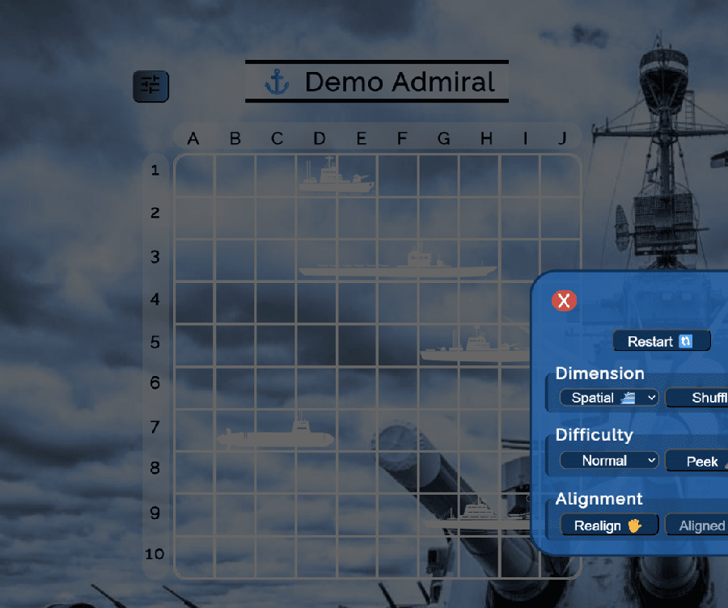
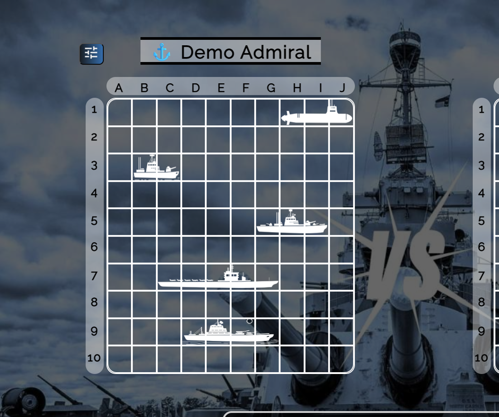
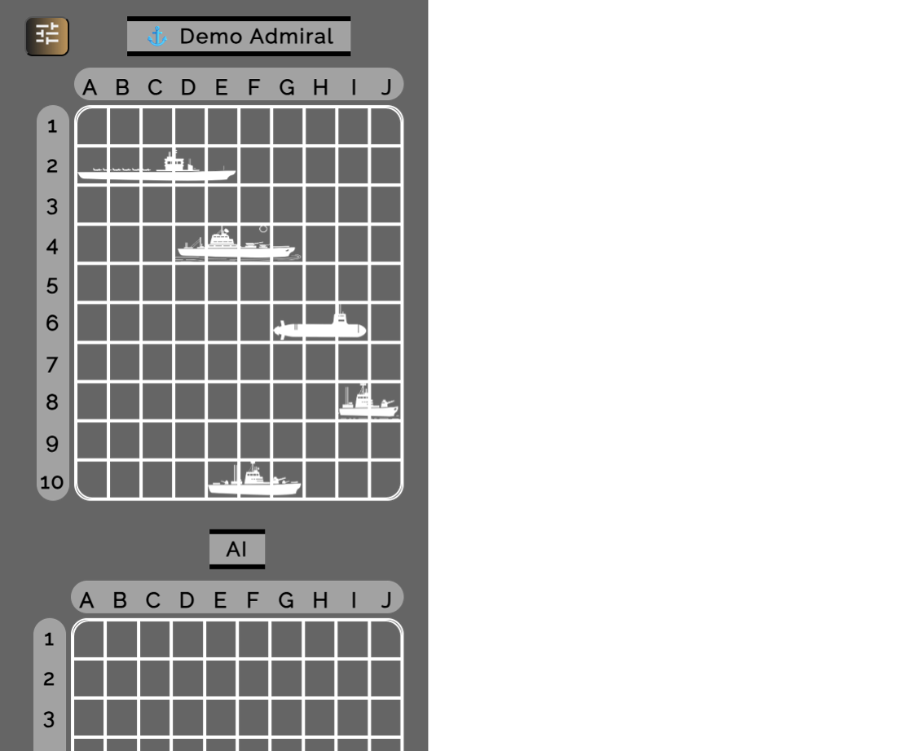

# Battleship

A browser-based Battleship game built with vanilla JavaScript, Webpack, and Jest. Play against an AI opponent on a dual-board battleground with ship placement, difficulty levels, and real-time battle feedback.

**[Live preview](https://asdacosta.github.io/battleship/)**

## Demo



### Screenshots

| Desktop | Mobile |
| --- | --- |
|  |  |

## Features

- **Turn-based combat** — You and the AI alternate attacks on a 10×10 grid until one fleet is destroyed.
- **Live feedback** — A status bar reports hits, misses, sunk ships, and victory or defeat.
- **Fleet visualization** — Choose **Spatial** (ship images) or **Simple** (color blocks) display modes.
- **Ship placement** — Random shuffle, manual drag-and-drop realignment (spatial mode), and alignment controls.
- **AI difficulty** — **Dummy** (favors misses), **Normal** (balanced), and **Impossible** (smarter targeting).
- **Peek** — Briefly reveal the AI board (about one second) to learn ship positions.
- **Settings panel** — Restart, shuffle, difficulty, dimension, and alignment without leaving the game.
- **Accessible UI** — Semantic markup, keyboard-friendly settings, focus styles, and reduced-motion support on the landing page.

## Quick start

### Prerequisites

- [Node.js](https://nodejs.org/) 18+ and npm

### Install

```bash
git clone https://github.com/asdacosta/battleship.git
cd battleship
npm install
```

### Development

Start the dev server with hot reload (opens the landing page):

```bash
npm start
```

Watch mode for rebuilding bundles:

```bash
npm run watch
```

### Production build

```bash
npm run build
```

Output is written to `dist/` (minified bundles and copied assets).

### Tests

```bash
npm test
```

Watch mode:

```bash
npm run "watch tests"
```

### Deploy to GitHub Pages

After building, push the `dist/` subtree:

```bash
npm run deploy
```

## How to play

1. Enter your **admiral name** on the landing page and click **BATTLE**.
2. Your fleet appears on the left board; the AI fleet is hidden on the right.
3. Click a cell on the **AI board** to attack. Misses (✗) end your turn; hits (💥) let you attack again.
4. Open **settings** (tune icon) to shuffle ships, change difficulty, switch display mode, peek at the AI board, or restart.
5. In **Spatial** mode, use **Realign** to drag ships, then **Aligned** when finished.
6. Sink all enemy ships to win; lose if the AI sinks yours.

## AI behavior

| Difficulty | Behavior |
| --- | --- |
| **Dummy** | Retries quickly after hitting your ships, making it easier for you. |
| **Normal** | Standard random targeting with a short delay between turns. |
| **Impossible** | Retries quickly after missing, hunting cells more aggressively. |

Difficulty is stored in `localStorage` and applied after a page reload.

## Project structure

| Path | Purpose |
| --- | --- |
| `src/index.html` | Landing page template |
| `src/index.js` | Landing page logic (name entry, navigation) |
| `src/style.css` | Landing page styles |
| `src/battleground.html` | Game board template |
| `src/battleground.js` | Game UI, turns, drag-and-drop, settings |
| `src/battleground.css` | Battleground layout and visuals |
| `src/logic.js` | Core classes: `Ship`, `Gameboard`, `Player` |
| `src/index.test.js` | Jest unit tests for game logic |
| `src/reset.css` | CSS reset shared by both pages |
| `src/assets/` | Images and icons (ships, backgrounds, lamp) |
| `src/babel.config.js` | Babel config used by the test toolchain |
| `dist/` | Webpack production output (deploy target) |
| `readme-assets/` | README screenshots and demo recording |
| `webpack.config.cjs` | Webpack entry, loaders, and HTML plugins |
| `babel.config.js` | Root Babel preset for Jest |
| `algorithm.txt` | Notes on game logic and algorithms |
| `package.json` | Scripts and dependencies |

## Tech stack

- **JavaScript (ES modules)** — Game logic and UI
- **Webpack 5** — Bundling, asset pipeline, dev server
- **Jest + Babel** — Unit tests
- **CSS** — Layout, responsive grids, theming

## Credits

| Asset | Source |
| --- | --- |
| `src/assets/admiral-edit.jpg` | [Pexels](https://www.pexels.com/) |
| `src/assets/ship-edit.jpg`, `src/assets/verticalship.jpg` | [Pexels](https://www.pexels.com/) |
| `src/assets/lamp.png` | [Flaticon](https://www.flaticon.com/) — InfoBrother |
| Ship icons (`battleship.png`, `carrier.png`, `destroyer.png`, `submarine.png`, `patrol-boat.png`) | [Flaticon](https://www.flaticon.com/) — Leremy |
| Configuration SVG | [Material Design Icons](https://pictogrammers.com/library/mdi/) |

## Origin

Built as part of [The Odin Project](https://www.theodinproject.com/) JavaScript curriculum, extended with UI polish, accessibility improvements, and documentation.

## Author

[Abraham Da Costa Silvanus](https://github.com/asdacosta)

## License

ISC
